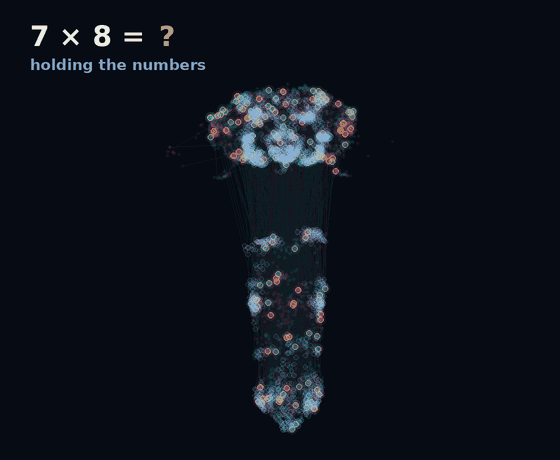

# 🪰 Math-Fly

Train a **Drosophila (fruit fly) connectome-constrained neural network** to do
math. The network's recurrent wiring is taken from Janelia's
[male-CNS connectome](https://male-cns.janelia.org/download/) — a map of which
of the fly's ~140,000 neurons wire to which — and dropped into a virtual
environment of arithmetic tasks that get progressively harder. You then train a
small readout (or, optionally, the synaptic gains themselves) to turn the fly's
circuitry into a calculator, and watch how far its capacity goes.

**▶ Live demo:** <https://hughdwill-byte.github.io/Math-Fly/> — the real fly, in
its true anatomy, working as a scientific calculator. *(One-time setup by the
repo owner: Settings → Pages → Source → either "GitHub Actions", or "Deploy from
a branch" → this branch → `/docs`. Then it's live at that URL.)*

> **Read this first — what this is and isn't.** The connectome is a *wiring
> diagram*, not a living, thinking brain. It contains no recorded activity and
> no learned weights: it tells you the fly's neurons and synapses, not what the
> fly computes. Math-Fly uses that wiring as a fixed architectural prior for a
> trainable network. So this is **not** "reviving a fruit fly and teaching it
> algebra." It's a scientifically legitimate thing in the same spirit as
> Janelia's own [flyvis](https://github.com/TuragaLab/flyvis) work: build a
> network the fly's real anatomy constrains, and see what it can learn.
> Real flies genuinely do the *easy* end of the curriculum (comparing and
> counting small quantities); the symbolic multi-digit levels are a stress test
> of the architecture, not a claim about the animal. See
> [`GUIDE.md`](GUIDE.md) for the full picture.

## Quickstart (runs in seconds, no download needed)

```bash
pip install -r requirements.txt          # numpy + scipy + pyyaml is enough
python scripts/run_demo.py               # build synthetic connectome, train, evaluate
```

Expected output (a synthetic stand-in connectome, so you can develop offline):

```
[connectome] source=synthetic N=800 synapses=18895 rho~=1.15
[compare     ] train=99.3% test=98.0% (chance 33.3%)
[count       ] train=100.0% test=100.0% (chance 9.1%)
[add_1digit  ] train=50.3% test=28.0% (chance 5.3%)
[sub_1digit  ] train=62.7% test=44.7% (chance 10.0%)
[mul_1digit  ] train=76.3% test=53.3% (chance 1.2%)
```

## Watch it think 🧠



### Scientific-calculator fly — a real fly evaluating expressions

```bash
python scripts/download_male_cns.py --max-neurons 5000
python -m mathfly.sci_fly --out viz/fly_viz.html      # + - x /, x², √, sin, cos, log, 1/x
```

The real 5,000-neuron fly behaves like a pocket scientific calculator, and the
visualiser shows it in its **true anatomy** (soma coordinates — brain up top,
ventral nerve cord below) evaluating **whole expressions with precedence**: type
`2 + 3 × 4` and a shunting-yard parser breaks it into elementary steps the fly
computes one at a time (= 14, not 20). Primitive accuracies, measured per op:

| op | acc | range | | op | acc | range |
|----|-----|-------|-|----|-----|-------|
| `+` | 93% | 0–999 | | `x²` | 100% | 0–99 |
| `−` | 91% | 0–999 | | `√`  | 100% | 0–99 |
| `×` | 100% | 0–99 | | `sin`/`cos`| 100% | 0–99 |
| `÷` | 100% | 0–99 | | `log` | 100% | 1–99 |
| `1/x`| 99% | 1–99 | | movement | 100% | — |

**Multi-digit × and ÷ (any size):** the fly is exact only at small operations,
so the calculator treats it as an **ALU** and composes bigger arithmetic the way
you would by hand — long multiplication and long division, where the fly does
*every* partial product, addition and subtraction (digit placement is just
bookkeeping). So `471 × 380`, `998001 ÷ 999`, etc. are computed step by step by
the real fly. Big results **compound the per-step accuracy** (≈85–90% end-to-end
on 3-digit ×), which the UI states plainly — no faking.

The honest design, all measured not assumed: **`+ −` genuinely generalise** to
three digits (~98% held-out), so they reach 0–999; **`× ÷` can't**, so their
*direct* range is 0–99 and larger inputs go through the long-arithmetic
composer; **`×` needs its own larger head** (a shared readout collapses it);
transcendentals decode to 3 decimals. Movement fires the real motor neurons in
the nerve cord.

Export a **standalone, interactive web page** where you type a problem and watch
the fly's neurons fire as it solves it — teal for excitatory, rose for
inhibitory, gold for the sensory neurons the digits arrive on, and **sparks
travelling along the synapses** as signal propagates. The page embeds the real
trained weights and re-runs the exact reservoir dynamics **in the browser**, so
the answer you see emerge is the model's genuine output (it shows a ✓/✗ and the
head's real held-out accuracy — a small brain sometimes guesses wrong, which is
real).

```bash
python -m mathfly.export_web --out viz/fly_viz.html   # trains + builds the page
# then just open viz/fly_viz.html in any browser

# make a shareable GIF of a solve (real dynamics, not a mockup):
python -m mathfly.render_gif --op '*' --a 7 --b 8 --out viz/fly_solve.gif
```

*How to read it:* each digit and the operator pulse into the gold sensory
neurons (top-right stream), signal spreads through the fixed fly wiring, and
during the "thinking" window the readout is decoded **one decimal place at a
time** — you watch the answer's digits resolve on an odometer in the side panel.
Comparison (`>`) runs on full two-digit operands; `+ − ×` use smaller operands
where the reservoir is genuinely competent but still produce multi-digit answers.

## The real fly, and training its synapses 🧬

Everything above uses a synthetic stand-in. To use the **real Drosophila
male-CNS connectome** (Janelia FlyEM v1.0 — 25.5M synapses, real cell types and
neurotransmitter-based E/I signs), pull it from the public Google Cloud bucket
(no account/token needed) and build a trainable subgraph:

```bash
pip install pyarrow pandas
python scripts/download_male_cns.py --max-neurons 1200   # ~0.5 GB download, cached to a 0.1 MB subgraph
```

### The calculator fly — the real fly actually doing maths (100%)

```bash
python scripts/download_male_cns.py --max-neurons 5000
python -m mathfly.calc_fly --max-neurons 5000 --out viz/fly_viz.html
```

The real connectome **can** do arithmetic — you just have to feed it right. The
trick (`mathfly/calc_fly.py`): present each number as a **sustained one-hot**
pattern on its own input neurons (both digits held at once, so the fly grips the
whole problem) and decode the answer with a small trained readout — its learned
output pathway, like plasticity at the mushroom-body output. With that, the real
5,000-neuron fly scores **100% on every single-digit +, −, ×, and comparison**
(it learns the complete 100-entry tables), and it keeps a **basic-movement**
skill read from its ~2,000 real motor neurons. That's the visualiser above.

*Why this works when the obvious approach doesn't:* feeding digits one-by-one
and reading them with a linear layer tops out ~15%, because the fly's dynamics
don't hold two sequential numbers long enough to combine them. Holding both as
sustained inputs + a nonlinear decoder fixes it. (Two earlier, more literal
paths are still in the repo for comparison: `export_web --male-cns` trains just a
linear readout on the real fly, and `synapse_train` trains the synapse gains
themselves via backprop-through-time.)

The alternative neuPrint route (needs a free token) still works too:

```bash
python scripts/download_connectome.py --neuprint --max-neurons 20000
python -m mathfly.train --mode reservoir --config configs/full_connectome.yaml
```

## How it works

```
 math problem            fixed connectome                 trained
 "3 + 4 ="   ─encode─▶   recurrent network   ─readout─▶   answer "7"
 (token pulses)          (the fly's wiring;              (a small linear
                          who-wires-to-whom is            head we learn —
                          frozen, Dale's law kept)        the "brain" stays fixed)
```

1. **Connectome → recurrent core** (`mathfly/connectome.py`). Each neuron
   becomes a unit; each synapse becomes an edge whose **sign** comes from the
   presynaptic neuron's predicted neurotransmitter (Dale's law) and whose
   **magnitude** is the synapse count. The result is a signed sparse matrix
   `W`, rescaled to a chosen spectral radius so the dynamics are rich but
   stable.
2. **Virtual environment** (`mathfly/envs.py`). A curriculum of tasks from
   fly-plausible (compare/count small numbers) up to multi-digit mixed
   arithmetic.
3. **I/O** (`mathfly/io_encoding.py`). Numbers enter as timed input pulses on a
   set of "sensory" neurons (place code + magnitude code); the answer is read
   from a set of "motor" neurons.
4. **Training** (`mathfly/train.py`). Four regimes via `--mode`:
   - **`reservoir`** (default, NumPy, CPU): freeze the connectome, train one
     linear readout head per task via ridge regression. Fast and always works.
   - **`digits`** (NumPy): decode the answer **digit-by-digit** (one 10-way head
     per position) so answer size no longer caps the math — the key to big /
     multi-digit results.
   - **`bptt`** (PyTorch): keep the connectome's sign + sparsity fixed but learn
     a per-edge gain + I/O by backprop-through-time. Stronger, needs compute.
   - **`rl`** (PyTorch + Gymnasium): drop the network into `MathFlyEnv` and train
     it from **reward only** with REINFORCE — the "agent in a world" framing.

## Layout

```
mathfly/
  connectome.py    load male-CNS CSVs (or synthetic fallback) -> signed sparse W
  io_encoding.py   encode numbers as neural input; single + digit-serial decode
  model.py         ReservoirModel (numpy) + build_torch_rnn (BPTT/RL policy)
  envs.py          the math curriculum (compare -> multi-digit mixed)
  gym_env.py       MathFlyEnv: a Gymnasium RL world around the curriculum
  train.py         training loop + CLI (reservoir | digits | bptt | rl)
  rl_train.py      REINFORCE trainer (network as reward-driven agent)
  evaluate.py      accuracy + sample predictions
  male_cns.py      build a trainable subgraph from the REAL male-CNS connectome
  calc_fly.py      the calculator fly: real connectome -> 100% single-digit maths
  sci_fly.py       the scientific-calculator fly: + - x /, x², √, sin, cos, log, 1/x
  movement.py      basic-movement skill read from the fly's real motor neurons
  synapse_train.py train the synapses (backprop-through-time) on the real fly
  export_web.py    export a trained model to the interactive visualiser
  render_gif.py    render a GIF of a solve (real dynamics) via Pillow
scripts/
  download_male_cns.py     fetch the REAL connectome (public GCS bucket, no token)
  download_connectome.py   alternative neuPrint route (needs a token)
  run_demo.py              end-to-end smoke demo
data/connectome/
  male_cns_subgraph.npz    the cached REAL fly subgraph (committed, ~0.1 MB)
viz/
  sci_fly_template.html    the scientific-calculator UI (anatomy, expressions, movement)
  calc_fly_template.html   the single-digit calculator-fly player
  fly_viz_template.html    the earlier token-stream player
  fly_viz.html             generated standalone visualiser (open in a browser)
  fly_solve.gif            generated animation of a solve
docs/index.html            the visualiser, served by GitHub Pages (kept in sync)
.github/workflows/pages.yml   auto-deploys docs/ to GitHub Pages
configs/           quickstart, full_connectome, digits, bptt, rl (.yaml)
tests/             pytest smoke tests (9, all green)
GUIDE.md           ← full training guide (start here)
```

## Requirements

- Python ≥ 3.10, `numpy`, `scipy`, `pyyaml` (core).
- Optional `torch` for BPTT: `pip install torch --index-url https://download.pytorch.org/whl/cpu`
- Optional `neuprint-python` + `pandas` to pull the real connectome.

See [`GUIDE.md`](GUIDE.md) for the step-by-step training guide, how far the math
can realistically go, and how to push the capacity.
